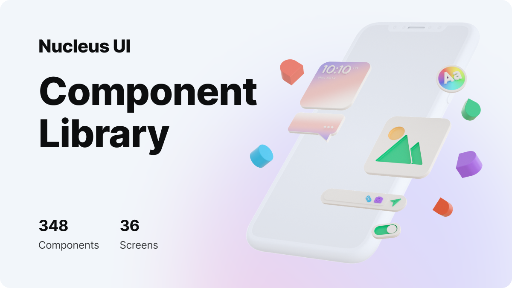

## Installation

```sh
npm install react-native-nucleus-ui
```

## Usage

```js
import { Button } from "react-native-nucleus-ui";

// ...
<Button title="Login" size='large' appearance='primart' />
```

## Design

https://www.nucleus-ui.com

## Contributing

See the [contributing guide](CONTRIBUTING.md) to learn how to contribute to the repository and the development workflow.

## License

MIT
